# Microsoft-Windows-Firewall

 ## **Configure Firewall Rules Using Windows Defender Firewall**

1.Click the Windows **Start** button. and then select **Windows Security**.

2.Click **Firewall & network protectio**n .

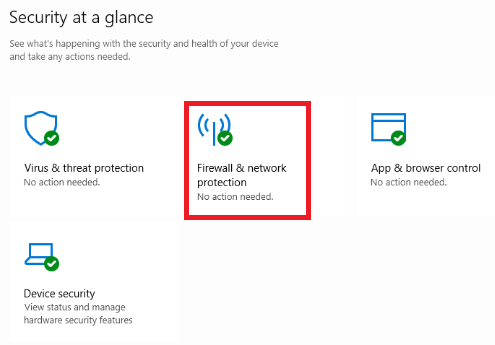

3. Here you will see the firewall status for the following:

**Domain network:** Domain networks are workplace networks. A computer must be a part of the domain in order to communicate with other computers on that network. 

**Private network:** Private networks are discoverable networks, meaning that only devices on that network can see or discover other devices on that same network. Home networks are a good example of a private network. 

**Public network:** Public networks are non-discoverable networks. A non-discoverable network is a network where your device cannot be discovered by other devices on your network. A coffee shop or a library would be a good example of a public network. You do not want other individuals to be able to discover your device.

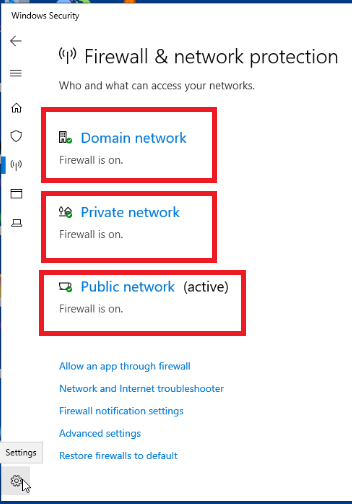

4.Click **Domain network**.

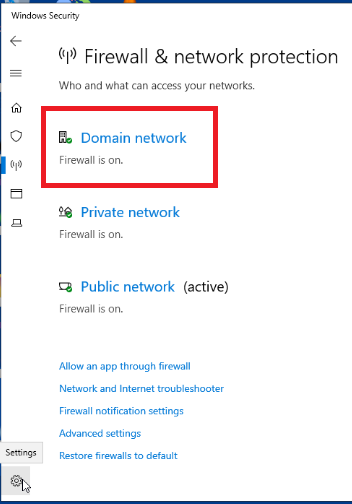

5.Verify that the **Windows Defender Firewall** is toggled to **On**.
Observe the option **Incoming connections**. If you need to block all incoming domain network traffic, including traffic that is typically allowed, then you only need to activate this option. You do not need to enable this option for this lab.

Note that if you have installed a 3rd Party anti-virus software, this option will be disabled. You can only control the firwall settings through the anti-virus software.

Select the back arrow button to return to the **Firewall and network protection** window.

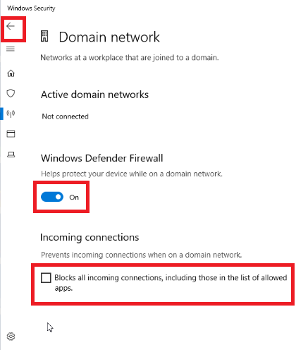

6.Click **Private network**.

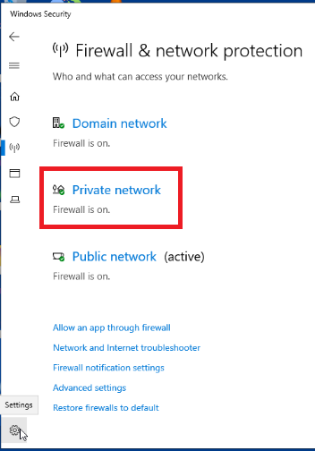

7.Verify that the Windows Defender Firewall is toggled to **On**.
Observe the option **Incoming connections**. If you need to block all incoming domain network traffic, including traffic that is typically allowed, then you only need to activate this option. You do not need to enable this option for this lab.

Note that if you have installed a 3rd Party anti-virus software, this option will be disabled. You can only control the firwall settings through the anti-virus software.

Select the back arrow button to return to the **Firewall and network protection** window.

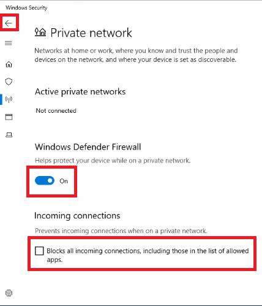

8.Click **Public network**.

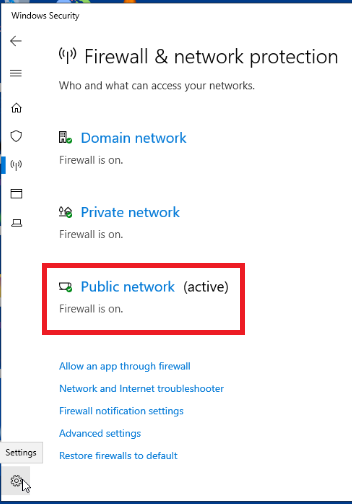

9.Verify that the Windows Defender Firewall is toggled to **On**.

Observe the option **Incoming connections**. If you need to block all incoming domain network traffic, including traffic that is typically allowed, then you only need to activate this option.You do not need to enable this option for this lab.

Note that if you have installed a 3rd Party anti-virus software, this option will be disabled. You can only control the firwall settings through the anti-virus software.

Select the back arrow button to return to the **Firewall and network protection** window.

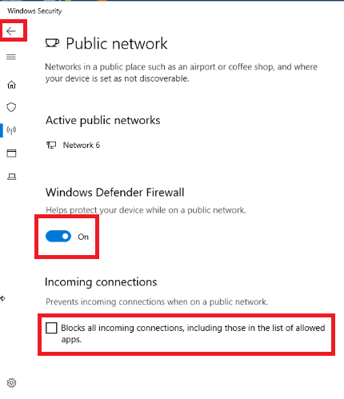

10.Click **Allow an app through firewall**.

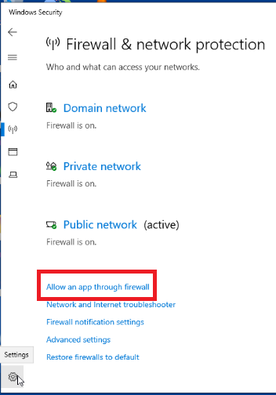

11.Scroll to **Mozilla Firefox**. Note that the current configuration allows for Firefox to communicate on the Private network but denies it from communicating on the Public network.

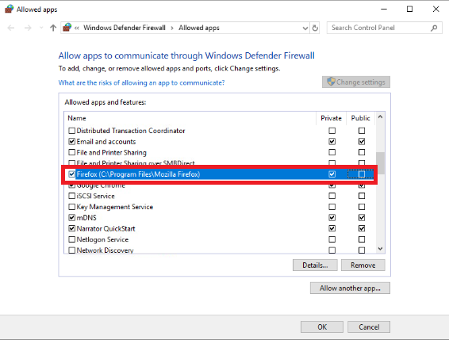

12.Click the **Public** box next to Firefox. A checkmark will appear. Click **OK** to return to the **Firewall & network protection**  screen. Users will now be able to use Mozilla Firefox on the public network.
Allowing Mozilla Firefox to be used on the public network.

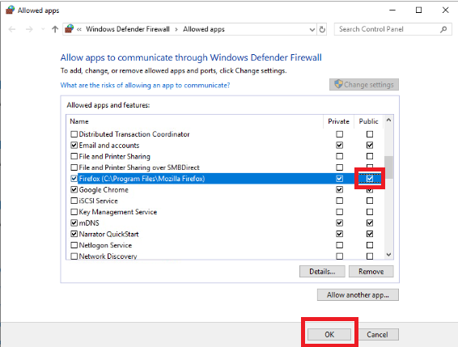

## **Configure Firewall Rules using Windows Defender Firewall with Advanced Security**

1.Select **Advanced settings** on the Firewall & network protection screen.

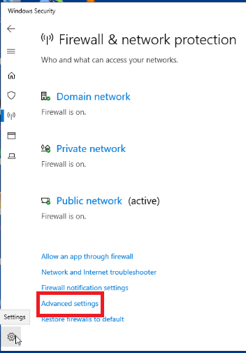

2.Here you will see an **Overview** in the center panel. Make special note of the two rule types listed on the left panel:

**Inbound rules:** Inbound rules determine what traffic is allowed to the computer.

**Outbound rules:** Outbound rules determine what traffic is allowed to leave the computer.

**Connection security rules**

**Monitoring**

Each of these rules can be configured to filter traffic based on computers, users, applications, ports, protocols, and so on.

Click **Inbound rules**.

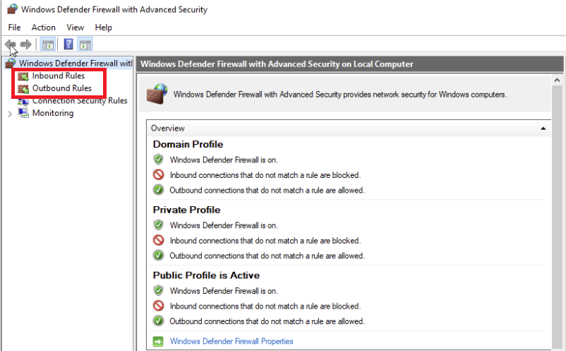

3.Here you will see a long list of inbound rules. Note that some of the rules have a green checkmark next to them. This indicates that the rule is enabled to allow inbound communication. The rules without a checkmark are available for use but are not enabled.

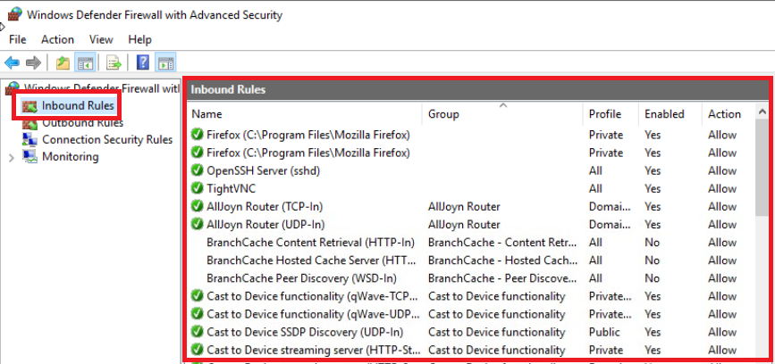

4.Scroll to the **Key Management Service** inbound rule in the Overview panel of **Windows Defender Firewall with Advanced Security**. Note the following:

<li>The policy is currently not enabled (the <b>Enabled column</b> says <b>NO</b>.)</li>

<li>If enabled, the rule would allow communication (the <b>Action</b> column says <b>Allow</b>.)</li>

Double-click this rule.

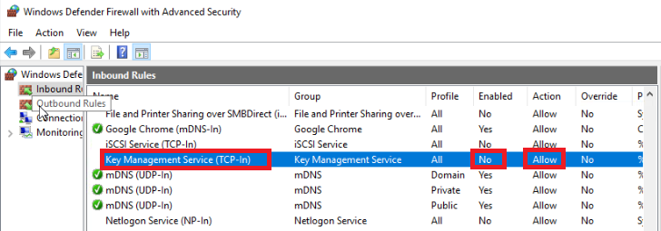

5.Here you will see the details of this rule. You will note that the **General** tab includes the name of the rule, a description of the rule, and whether the rule has been allowed or blocked. In this case, the connection is allowed. Click the **Advanced** tab.

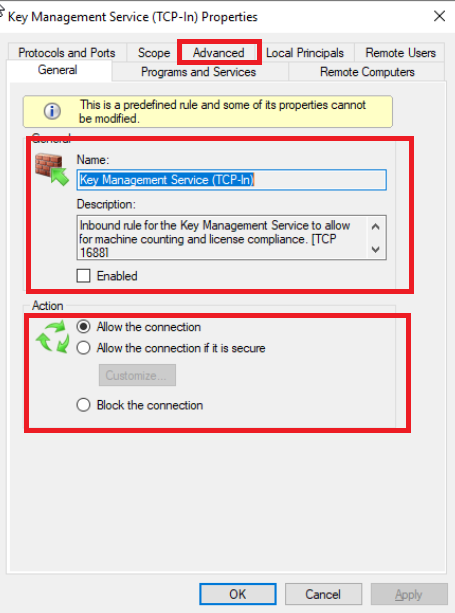

6.Here you will see which profiles the rule applies to. In this case, **Domain**, **Private** and **Public** are all selected.

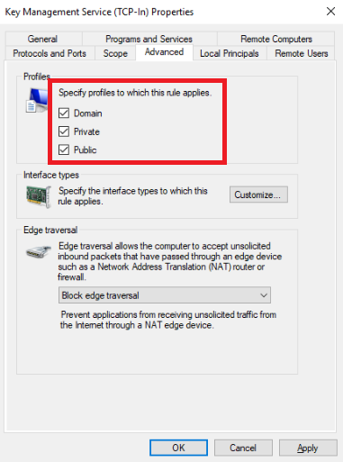

7.Because we want to allow communication only with the domain and private networks, For **Public** this box should not have a checkmark. Next, click **Apply**, then click **Ok**.

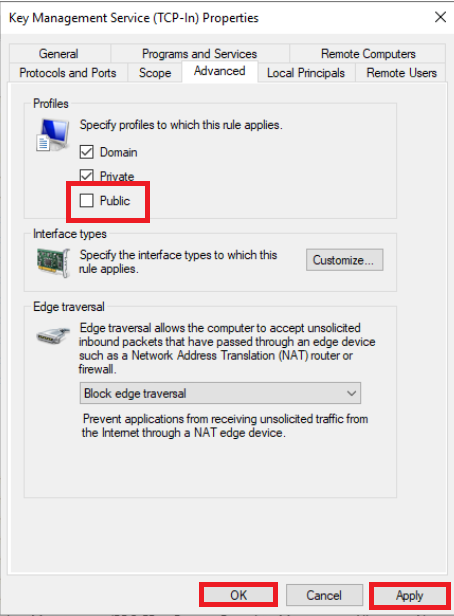

8.Now we will create an inbound rule that blocks communication with the public network. Since the new rule will be similar to the last, we will copy the existing rule. Right-click the **Key Management Service (TCP-In)** inbound rule and click **Copy**. Press **Ctrl+V** to paste.

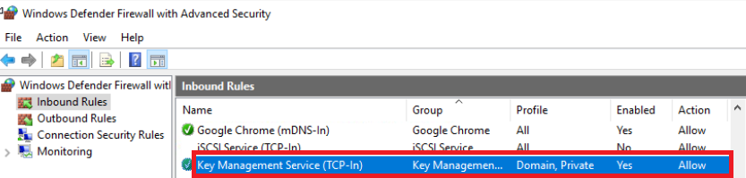

9.You will now see a second **Key Management Service (TCP-In)** inbound rule. Double-click the second rule to open the **Key Management Service TCP-IN**) Properties.

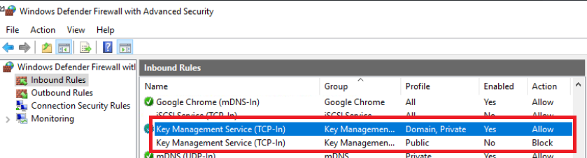

10.Since we want to block connection with the public network, select **Block the connection** on the **General** tab. Click **Apply**.

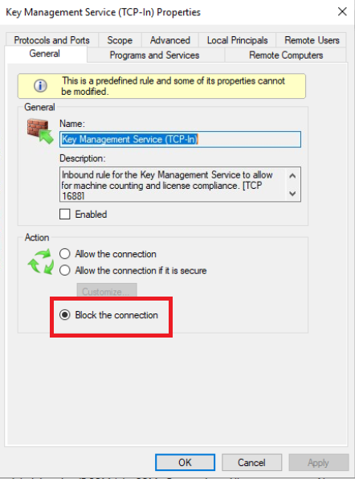

11.Click the **Advanced** tab.

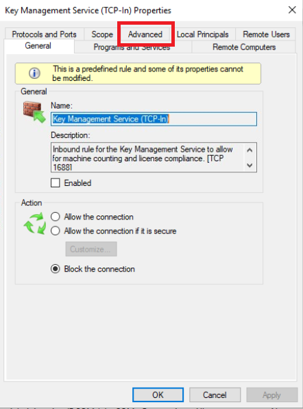

12.Click the **Domain** and **Private** boxes to remove the checkmarks. Click the **Public** to add the checkmark. Click **Ok**.

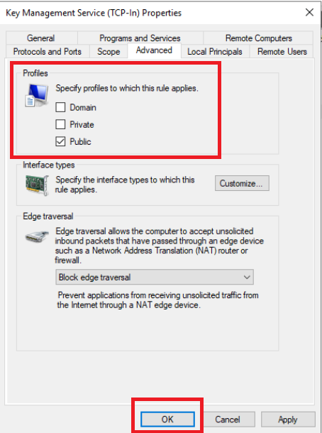

13.The Overview panel will show your changes. Right-click each **Key Management Service (TCP-In)** rule and click **Enable rule**.

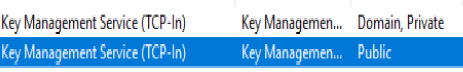

14.Now you will see that a green checkmark appears next to the first rule indicating that the rule allowing communication is enabled. A circle with a line through it appears next to the second rule indicating that the rule blocking communication is enabled.

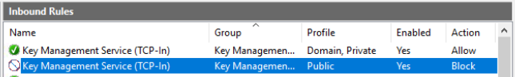

<a href="https://github.com/SalaiSwetha/Microsoft-Windows-Defender-and-Firewall-.git"> **Back to Main Page** </a>
